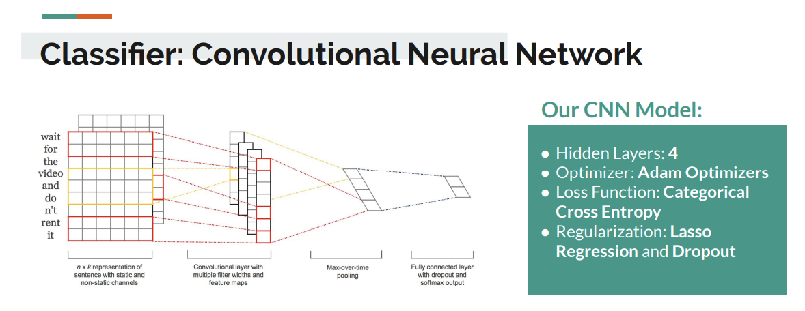
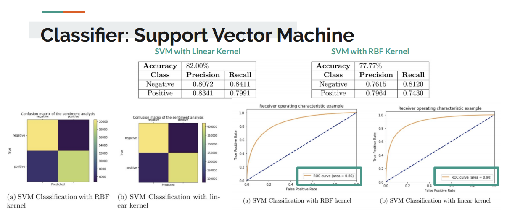
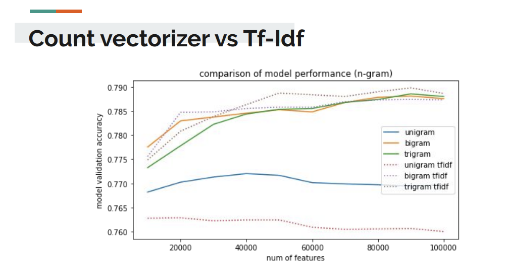
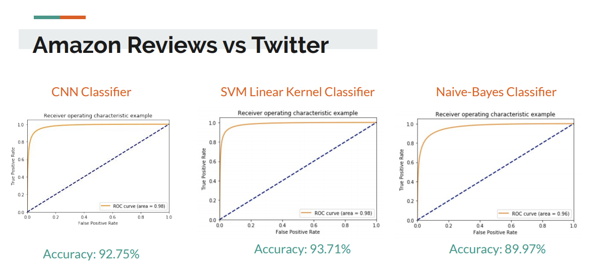

# Predicting Sentiment on Social Media Data Using Supervised Approaches
​
Authors: [Fadhil Mochammad](https://www.github.com/fadhilmch) (fadhilm@kth.se), [M. Irfan Handarbeni](https://www.github.com/handarbeni) (handa@kth.se), Mehrdad Darraji

This project was developed as part of the [DM2583 Big Data in Media Technology](https://www.kth.se/student/kurser/kurs/DM2583?l=en) at [KTH Royal Institute of Technology](https://www.kth.se), Spring 2019  

The code is built using Keras and implemented on Jupyter Notebook.
​
## Abstract
​
In the last couple of decades, the use of social media websites has been increased tremendously. Millions of people use it to express their views and opinions on a wide array of topics. As a result, social media websites generate large volumes of data. In this paper, we will discuss several sentiment analysis algorithms and compare the performances of those algorithms using Twitter data. We have implemented the sentiment analysis algorithm using Multinomial Naive Bayes, Support Vector Classification, and Convolutional Neural Networks. Data preprocessing is a crucial step in sentiment analysis, since selecting the right preprocessing methods can increase the performance of our sentiment analysis. Based on this view, this paper will also discuss various preprocessing methods that usually use on sentiment analysis and compare the role of those different preprocessing methods to the performance of our sentiment analysis. The data preprocessing and sentiment analysis algorithm are done using NLTK, Scikit-learn, and Keras libraries. Experimental results obtained demonstrate that Linear Support Vector Machine classifier gives very high predictive accuracy and outperform others. Result also prove that the right feature selection and representation on data preprocessing can affect the performance of our sentiment analysis.
​
## Overview
The main purpose of this research is to find out which algorithm produces the best result in sentiment analysis. As mentioned earlier, we have done this using Deep Learning algorithm and some traditional machine learning algorithms such as Naive Bayes and Support Vector Machine. In this project, we also use the Convolutional Neural Network (CNN) architecture for our Deep Learning algorithm.
​

Data preprocessing is also a crucial step in sentiment analysis. We believe that selecting the right preprocessing methods will generate a good data representation that can increase the performance of our sentiment analysis. Based on this background,  we further want to investigate the correlation between data and the performance of our algorithms. We will compare the effects of various data preprocessing on the results of our sentiment analysis algorithm. Here are some pre-processing methods that we use:
 1. Removal of noisy data (username, URLs, special characters)
 2. Contraction mapping
 3. Spell Correction
 4. Removal of Stop-words
 5. Lemmatization and word-stemming
​
## Exploratory Data Analysis
Here are some summary that we got from the dataset exploration:
1. There are around 36.373 tweets that only contains links or mentions
2. Both negative and positive are around the same number
3. We explored the frequency of the negative and positive words
    - Words such as “bad, ” “miss,” and “sad” appear more frequently on negative class
    - Words such as “thank,” “well,” and “awesome” appear more frequently on positive class
4. Calculate positivity and negativity of the top 5000 frequent words
    - Words such as “excited”, “amazing”, and “happy” are highly positive
    - Words such as “sick”, “sucks”, “sad”, and “ugh” are highly negative
More detail exploratory data analysis contained in [Project_EDA.ipynb](project_eda.ipnyb)
​
## Dataset
Crawling the data from Twitter using Twitter API will be taking too much time because Twitter limits the number of tweets on each API call. Also, crawling data using web-scrapping approach will also be taking a while since we have to learn the HTML structure first. Hence, due to the limited time constraint for this project assignment, we decided to utilize ready-to-use social media dataset available on the internet.

### 1. Sentiment140
Sentiment140 is a product created by Stanford University graduates. Their work allows one to discover the sentiment of brands, products, or topics on Twitter. They recorded about 1.6 million tweets in the format of polarity, id of the tweet, date of the tweet, the query, user of the tweet, and the text of the tweet. Specifically for this project, we decided to split the data into 600 thousand training data and 1 million test data\cite{sentiment140}.
Reference:
* [Raw Dataset](http://help.sentiment140.com/for-students)
* [Our Cleaned Dataset](https://www.kaggle.com/fadhilmch/sentiment140-cleaned/downloads/sentiment140-cleaned.zip/1)
​
### 2. Amazon Reviews for Sentiment Analysis
4 million Amazon reviews split into 3.6 million for training and 400 thousand for testing purposes formatted by the polarity and the review of products from the website. Although for this project, we only used the 1.5 millions of the actual training data and split it into 500 thousand training data and 1 million test data.
Reference:
* [Raw Dataset](https://www.kaggle.com/bittlingmayer/amazonreviews)
* [Our Cleaned Dataset](https://www.kaggle.com/fadhilmch/amazon-reviews-cleaned-big-data-project/downloads/amazon-reviews-cleaned-big-data-project.zip/2)
​
## Training
Before training, ensure that you already have the folder ~/dataset/ that contains:
1. train_cleaned_reviews.csv
2. test_cleaned_reviews.csv
​
## Result
1. The best model for Twitter Sentiment Analysis is SVM Classifier using Linear Kernel with accuracy score 82% and AUC score 86%.

2. Proper data pre-processing and feature extractions are needed to produce optimal and efficient model.
3. Using trigram TF-IDF as feature extraction method performs best.

4. We do not manage to achieve our target to get accuracy above 90% on the Twitter dataset. On the other hand, we get above 90% accuracy on Amazon Review Dataset since it contains richer words and longer text.

5. The result of our model is above the average of other sentiment analysis systems for Twitter dataset.

​
